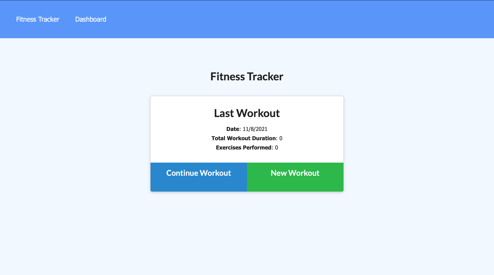
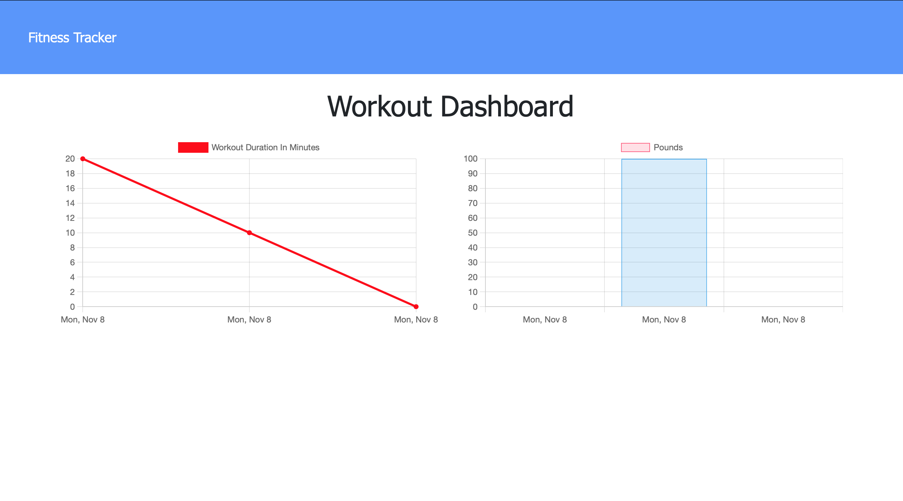

# workoutTracker
## Description
The main motivation for creating this project was to add backend Database Functionality to a workout tracker app. The Frontend app was already given but the back end required models and routes executed using MongoDB to achieve full functionality of the app. With full functionality this app allows the user to store and view previous workouts/exercises over time. 

The main problems this app solves include:
* Creating a backend MongoDB database for storing various workouts
* Creating a live webpage using Heroku that utilizes MongoDB to host the stored data.

Overall this project helped me to understand how to create model and routes using MongoDB and its associated packages while also gaining more familiarity with deployment on Heroku using AtlasDB. 

## Installation
Node was required to be installed. Various Node_modules and packages were needed to be installed for express as well as package-lock.json which correspond with the supplied package.json
``npm i``

## Technlogies used
* Javascript
* Express.js
* Node.js
* MongoDB
* Heroku
* Atlas DB

## Usage
``npm start``

## License 
MIT License

            Copyright (c) 2021 Hamza Khalid
            
            Permission is hereby granted, free of charge, to any person obtaining a copy of this software and associated documentation files (the "Software"), to deal in the Software without restriction, including without limitation the rights to use, copy, modify, merge, publish, distribute, sublicense, and/or sell copies of the Software, and to permit persons to whom the Software is furnished to do so, subject to the following conditions:
            
            The above copyright notice and this permission notice shall be included in all copies or substantial portions of the Software.
            
            THE SOFTWARE IS PROVIDED "AS IS", WITHOUT WARRANTY OF ANY KIND, EXPRESS OR IMPLIED, INCLUDING BUT NOT LIMITED TO THE WARRANTIES OF MERCHANTABILITY, FITNESS FOR A PARTICULAR PURPOSE AND NONINFRINGEMENT. IN NO EVENT SHALL THE AUTHORS OR COPYRIGHT HOLDERS BE LIABLE FOR ANY CLAIM, DAMAGES OR OTHER LIABILITY, WHETHER IN AN ACTION OF CONTRACT, TORT OR OTHERWISE, ARISING FROM, OUT OF OR IN CONNECTION WITH THE SOFTWARE OR THE USE OR OTHER DEALINGS IN THE SOFTWARE
            
## Badges

## Live Deployement 

https://pure-chamber-45773.herokuapp.com/?id=6188b9f12c27c60016a3bc27
### Screenshots

